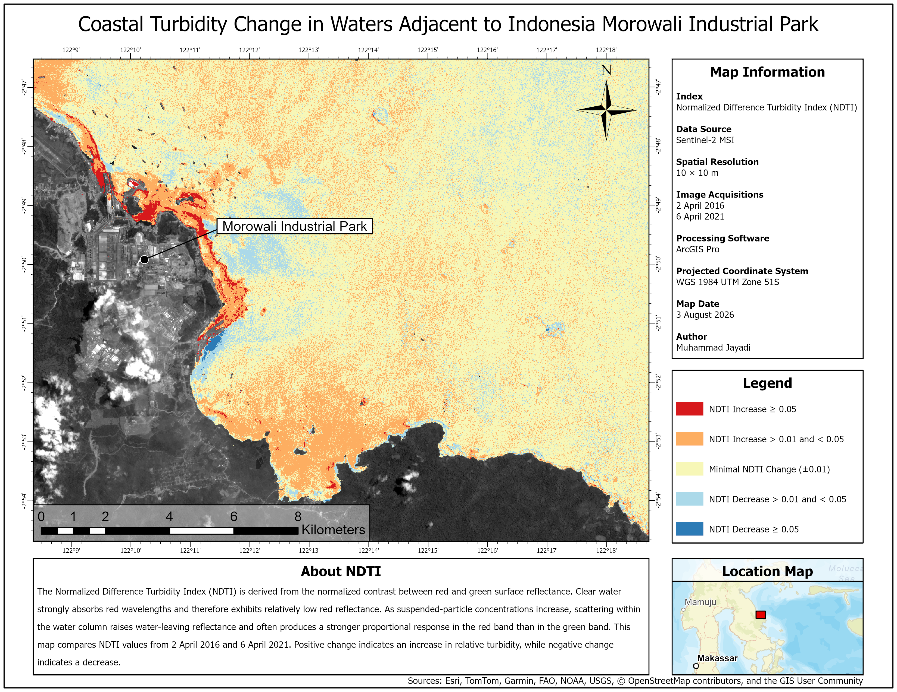

# 

# Coastal Turbidity Change in Waters Adjacent to Indonesia Morowali Industrial Park

## Project Overview

Located on the coast of Central Sulawesi, the Indonesia Morowali Industrial Park underwent rapid expansion during the study period following the start of nickel pig iron production in 2015. This project evaluates changes in the optical turbidity signal of adjacent coastal waters using Sentinel-2 Multispectral Instrument imagery acquired on 2 April 2016 and 6 April 2021.

An automated ArcPy workflow applies Sentinel-2 Scene Classification Layer masking, delineates water using the Normalized Difference Water Index (NDWI), and calculates the Normalized Difference Turbidity Index (NDTI). Water masks from the two dates are intersected to isolate persistent water for the multi-date change analysis. The results indicate widespread positive NDTI change, with the strongest increases concentrated along sections of shoreline adjacent to the industrial park.

## Deliverable

# Global Snow Persistence Explorer

## Project Overview

Global Snow Persistence Explorer is an interactive Google Earth Engine application for exploring annual snow persistence worldwide using ERA5-Land data. Daily snow cover data are aggregated by calendar year to calculate snow-covered days and annual snow persistence, which is then classified into four snow persistence zones.

The application maps these zones, calculates their global area, and provides a location inspector for examining snow-covered days, annual snow persistence, monthly mean snow water equivalent (SWE), and glacier or ice cap information. It supports complete calendar years from 1951 to 2025. :contentReference[oaicite:0]{index="0"}

## Deliverable

`<iframe width="900" height="700" src="https://muhammadihsanjayadi34.users.earthengine.app/view/global-snow-persistence-explorer"`{=html}

</iframe>

[Open the Global Snow Persistence Explorer in a new window](https://muhammadihsanjayadi34.users.earthengine.app/view/global-snow-persistence-explorer)
